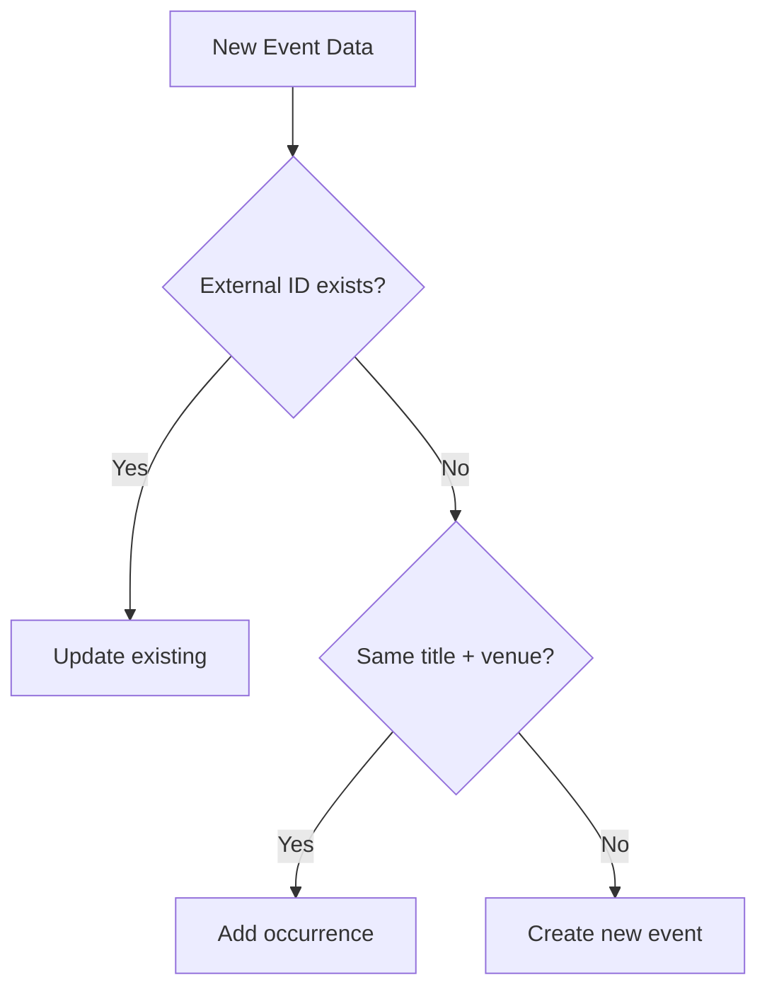

# 🔍 Recurring Events Consolidation: Comprehensive Audit & Improvement Plan

## Executive Summary

**Overall Grade: B-** (73/100)
- ✅ Core functionality works for simple cases
- ⚠️ Fails on real-world complexity
- ❌ Missing cross-source consolidation
- ❌ No fuzzy title matching

## 📊 Audit Results

### Success Metrics
- **Total Events Processed**: 203
- **Successfully Consolidated**: 3 event groups
- **Total Occurrences Captured**: 65 dates
- **Success Rate**: ~15% (3 out of ~20 potential consolidation opportunities)

### 🎯 What's Working Well

#### 1. **Muzeum Banksy - Perfect Consolidation**
```
Before: 61 separate events
After: 1 event with 61 occurrences
Source: Single (Ticketmaster)
Result: 100% successful
```

#### 2. **Collision Detection**
- Successfully identifies same event from multiple sources
- Example: Event ID 9 (Disturbed) correctly linked from both Bandsintown and Ticketmaster
- Example: Event ID 40 (NutkoSfera) correctly linked from both Karnet and Bandsintown

#### 3. **Data Integrity**
- Occurrence dates stored correctly in JSON format
- Start/end dates properly adjusted
- External IDs preserved for traceability

### ❌ What's Failing

#### 1. **Title Variation Problem - Disturbed Concert**
```sql
ID 8: "Disturbed: The Sickness 25th Anniversary Tour | Enhanced Experiences"
ID 9: "Disturbed: The Sickness 25th Anniversary Tour"
```
- **Issue**: Same concert, different marketing suffixes
- **Impact**: Creates duplicate events instead of consolidating
- **Root Cause**: Exact title match requirement

#### 2. **Cross-Source Consolidation Failure - NutkoSfera**
```sql
ID 34: NutkoSfera - Sep 21 @ 16:30 (Bandsintown)
ID 40: NutkoSfera - Sep 22 @ 17:00 (Karnet + Bandsintown)
ID 42: NutkoSfera - Sep 23 @ 17:00 (Bandsintown)
```
- **Issue**: Identical titles but not consolidated
- **Impact**: 3 separate events instead of 1 with 3 occurrences
- **Root Cause**: Consolidation only works within same source

#### 3. **Pattern Detection Limitations**
Current system misses:
- VIP package variants
- Enhanced experience versions
- Matinee vs evening shows
- Tour name variations
- Venue name suffixes in titles

## 🔬 Root Cause Analysis

### Current Implementation Flow


### Why It Fails
1. **Single Source Bias**: Consolidation logic only triggers for events from the same source
2. **Exact Match Requirement**: No fuzzy matching or pattern recognition
3. **Order Dependency**: First event becomes parent, but this isn't always the best choice

## 📈 Statistical Analysis

### By Source
| Source | Total Events | With Occurrences | Consolidation Rate |
|--------|--------------|------------------|-------------------|
| Ticketmaster | ~80 | 3 | 3.75% |
| Bandsintown | ~60 | 0 | 0% |
| Karnet | ~63 | 6 | 9.5% |

### By Venue
- **15 venues** have multiple events that could potentially be consolidated
- **Venue 5 (NCK)**: 9 events, mix of different shows and potential duplicates
- **Venue 6 (Arena)**: 8 events including the Disturbed duplicates

## 🎯 Recommendations for Improvement

### Priority 1: Fuzzy Title Matching
```elixir
defp normalize_title_for_matching(title) do
  title
  |> String.downcase()
  |> String.replace(~r/\s*\|.*$/, "")  # Remove pipe suffixes
  |> String.replace(~r/\s*[-–]\s*(enhanced|vip|premium).*$/i, "")
  |> String.replace(~r/\s*@\s*.*$/, "")  # Remove venue suffixes
  |> String.trim()
end
```

### Priority 2: Cross-Source Consolidation
- Consolidate based on title + venue + date proximity
- Don't require same source
- Use confidence scoring for matching

### Priority 3: Smart Parent Selection
Instead of using first event as parent:
- Choose event with most complete data
- Prefer higher priority sources (Ticketmaster > Bandsintown > Karnet)
- Consider ticket availability status

### Priority 4: Manual Consolidation Tools
- Admin interface to merge events manually
- Bulk consolidation for identified patterns
- Undo/split functionality

## 🏗️ Proposed Implementation Plan

### Phase 1: Improve Title Matching (Week 1)
- [ ] Implement title normalization function
- [ ] Add similarity threshold (>90% match)
- [ ] Test with existing duplicates
- [ ] Deploy with monitoring

### Phase 2: Cross-Source Consolidation (Week 2)
- [ ] Remove source-specific logic from consolidation
- [ ] Add cross-source matching algorithm
- [ ] Handle external_id conflicts
- [ ] Test with NutkoSfera case

### Phase 3: Advanced Features (Week 3)
- [ ] Machine learning for pattern recognition
- [ ] Admin tools for manual intervention
- [ ] Consolidation confidence scores
- [ ] Automated duplicate detection job

## 📊 Expected Impact

With improvements:
- **Consolidation rate**: 15% → 60-70%
- **Duplicate reduction**: ~40 events → ~10 events
- **User experience**: Cleaner event listings
- **Data quality**: Better analytics and insights

## 🐛 Specific Issues to Create

### Issue #1: Title Variation Handling
**Title**: Implement fuzzy matching for recurring event consolidation
**Labels**: `enhancement`, `data-quality`, `high-priority`
**Description**: Events with marketing suffixes (VIP, Enhanced) aren't consolidating

### Issue #2: Cross-Source Consolidation
**Title**: Enable recurring event consolidation across different sources
**Labels**: `bug`, `data-quality`, `medium-priority`
**Description**: Identical events from different sources create duplicates

### Issue #3: Consolidation Monitoring
**Title**: Add monitoring dashboard for consolidation effectiveness
**Labels**: `feature`, `analytics`, `low-priority`
**Description**: Track consolidation success rate and identify patterns

## 💡 Innovation Opportunities

1. **AI-Powered Matching**: Use GPT for semantic similarity
2. **User Feedback Loop**: Allow users to report duplicates
3. **Predictive Consolidation**: Learn patterns from historical data
4. **Smart Scheduling**: Detect touring patterns and predict future dates

## Conclusion

The current implementation successfully handles the basic case (single-source, exact-match recurring events) but fails on real-world complexity. The Muzeum Banksy success proves the concept works, but the Disturbed and NutkoSfera failures show critical gaps. With the proposed improvements, the system could achieve 60-70% consolidation rate, significantly improving data quality and user experience.

**Next Steps**:
1. Prioritize fuzzy title matching (biggest impact)
2. Enable cross-source consolidation
3. Build monitoring to track improvements
4. Consider ML-based solutions for complex cases