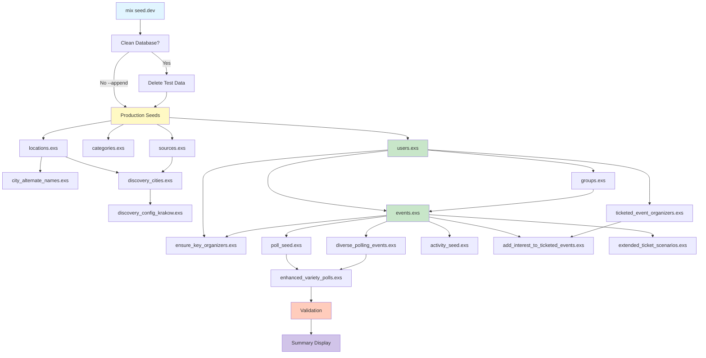

# Seed Dependencies & Execution Flow

This document visualizes the dependencies and execution flow of our seeding system.

## Quick Reference

- **Production Seeds**: `priv/repo/seeds.exs` + `priv/repo/seeds/*.exs`
- **Development Seeds**: `priv/repo/dev_seeds/runner.exs` + all files in `dev_seeds/`
- **Mix Tasks**: `mix seed.dev`, `mix seed.clean`

## High-Level Architecture

```
┌─────────────────────────────────────────────────────────────┐
│                     mix seed.dev                             │
│                                                               │
│  1. Clean Database (optional, controlled by --append flag)   │
│  2. Run Production Seeds                                      │
│  3. Run Development Seeds via runner.exs                      │
│  4. Validate Data Consistency                                 │
│  5. Display Summary                                           │
└─────────────────────────────────────────────────────────────┘
```

## Production Seeds Flow

```
priv/repo/seeds.exs (Main Orchestrator)
│
├─→ 1. Create Essential Users
│   └─→ Holden's account (holden@gmail.com)
│       └─→ With Clerk auth if configured
│
├─→ 2. Seed Locations
│   └─→ priv/repo/seeds/locations.exs
│       └─→ Countries & Cities with coordinates
│
├─→ 3. Seed Categories
│   └─→ priv/repo/seeds/categories.exs
│       └─→ 15 event categories (Concerts, Sports, etc.)
│
├─→ 4. Seed Sources
│   └─→ priv/repo/seeds/sources.exs
│       └─→ 14 scraping sources (Ticketmaster, Bandsintown, etc.)
│
├─→ 5. Seed Discovery Configuration
│   ├─→ priv/repo/seeds/discovery_cities.exs
│   │   └─→ Which cities have active scraping
│   │       [DEPENDS ON: locations.exs, sources.exs]
│   │
│   └─→ priv/repo/seeds/discovery_config_krakow.exs
│       └─→ Krakow-specific configuration
│           [DEPENDS ON: locations.exs, sources.exs, discovery_cities.exs]
│
└─→ 6. Seed City Alternate Names (optional)
    └─→ priv/repo/seeds/city_alternate_names.exs
        └─→ City name variations for matching
            [DEPENDS ON: locations.exs]
```

### Production Seed Dependencies

```
locations.exs
    │
    ├─→ city_alternate_names.exs
    │
    └─→ discovery_cities.exs ──┐
            │                   │
sources.exs ┴─→ discovery_config_krakow.exs
            │
categories.exs (independent)
```

## Development Seeds Flow

```
priv/repo/dev_seeds/runner.exs (Main Orchestrator)
│
├─→ 1. Load Configuration
│   └─→ From DEV_SEED_CONFIG env or defaults
│
├─→ 2. Optionally Clean Database
│   └─→ Delete existing test data (users, events, groups, etc.)
│
├─→ 3. Run Production Seeds
│   └─→ Code.eval_file("priv/repo/seeds.exs")
│       └─→ Ensures reference data exists
│
├─→ 4. Core Entity Creation
│   │
│   ├─→ USERS (dev_seeds/users.exs)
│   │   ├─→ Base users (configurable count, default: 50)
│   │   │   └─→ With Clerk auth if configured
│   │   │
│   │   └─→ Persona users (4 personas)
│   │       ├─→ admin@example.com
│   │       ├─→ demo@example.com
│   │       ├─→ organizer@example.com
│   │       ├─→ participant@example.com
│   │       ├─→ movie_buff@example.com
│   │       └─→ foodie_friend@example.com
│   │
│   ├─→ GROUPS (dev_seeds/groups.exs)
│   │   │   [DEPENDS ON: users]
│   │   │
│   │   ├─→ Regular groups (configurable, default: 15)
│   │   │   └─→ 5-20 members each
│   │   │
│   │   └─→ Themed groups
│   │       ├─→ The Dinner Club
│   │       ├─→ Movie Nights
│   │       ├─→ Tech Talks
│   │       └─→ etc.
│   │
│   └─→ EVENTS (dev_seeds/events.exs)
│       │   [DEPENDS ON: users, groups]
│       │
│       ├─→ Past events (~33% of total)
│       │   └─→ Status: confirmed or cancelled
│       │
│       ├─→ Upcoming events (~50% of total)
│       │   └─→ Status: polling or confirmed
│       │
│       ├─→ Future events (~17% of total)
│       │   └─→ Status: draft
│       │
│       └─→ Full capacity events
│           └─→ Edge case scenarios
│
├─→ 5. Feature-Specific Seeds (Order Matters!)
│   │
│   ├─→ ensure_key_organizers.exs
│   │   │   [DEPENDS ON: users, events]
│   │   │
│   │   └─→ Ensures movie_buff and foodie_friend have appropriate events
│   │
│   ├─→ ticketed_event_organizers.exs
│   │   │   [DEPENDS ON: users]
│   │   │
│   │   └─→ Creates organizer personas for ticketed events
│   │
│   ├─→ add_interest_to_ticketed_events.exs
│   │   │   [DEPENDS ON: events, users, ticketed_event_organizers]
│   │   │
│   │   └─→ Adds interested participants to ticketed events
│   │
│   ├─→ extended_ticket_scenarios.exs
│   │   │   [DEPENDS ON: users]
│   │   │
│   │   └─→ Phase 1: Extended ticketing scenarios (#2233)
│   │       ├─→ Free events
│   │       ├─→ Paid events
│   │       ├─→ Sold out scenarios
│   │       └─→ Early bird pricing
│   │
│   ├─→ diverse_polling_events.exs
│   │   │   [DEPENDS ON: events, users]
│   │   │
│   │   └─→ Phase I: Date + Movie star rating polls
│   │       ├─→ Date selection polls (binary voting)
│   │       └─→ Movie star rating polls
│   │
│   ├─→ poll_seed.exs
│   │   │   [DEPENDS ON: events, users]
│   │   │
│   │   └─→ Creates polls with options and votes
│   │       ├─→ 1-3 polls per eligible event
│   │       ├─→ 3-8 options per poll
│   │       ├─→ Realistic voting patterns (30-70% participation)
│   │       └─→ Various voting systems
│   │
│   ├─→ activity_seed.exs
│   │   │   [DEPENDS ON: events, users]
│   │   │
│   │   └─→ Creates activities for completed events
│   │       └─→ 1-5 activities per confirmed event
│   │
│   └─→ enhanced_variety_polls.exs
│       │   [DEPENDS ON: events, users]
│       │
│       └─→ Phase IV: Enhanced variety of poll types
│           ├─→ Multiple poll types (date, location, activity, food, movie)
│           ├─→ Complex voting patterns
│           └─→ Edge cases
│
├─→ 6. Validation
│   │
│   ├─→ Check: Events with polls have participants
│   ├─→ Check: No orphaned records
│   └─→ Report: Any inconsistencies found
│
└─→ 7. Summary Display
    │
    ├─→ User count (base + personas)
    ├─→ Group count (regular + themed)
    ├─→ Event count (past + upcoming + future + full)
    ├─→ Poll count
    ├─→ Activity count
    ├─→ Execution time
    └─→ Test account credentials
```

## Complete Dependency Graph

### Visual Dependency Tree

```
                    Production Seeds
                   (priv/repo/seeds.exs)
                            │
        ┌───────────────────┼────────────────────┐
        │                   │                    │
   locations.exs      categories.exs       sources.exs
        │                   │                    │
        │                   │              discovery_cities.exs
        │                   │                    │
  city_alternate_names      │         discovery_config_krakow
        │                   │                    │
        └───────────────────┴────────────────────┘
                            │
                    ┌───────┴───────┐
                    │               │
                 users.exs      (Reference Data Available)
                    │
        ┌───────────┼───────────┐
        │           │           │
   groups.exs   ticketed_event_ ensure_key_
        │        organizers      organizers
        │           │               │
        └───────────┴───────────────┘
                    │
                events.exs
                    │
    ┌───────────────┼───────────────┬───────────────┬─────────────┐
    │               │               │               │             │
poll_seed   diverse_polling  add_interest_  activity_seed  extended_ticket_
            _events          to_ticketed                   scenarios
    │               │        events          │             │
    │               │               │        │             │
    └───────────────┴───────────────┴────────┴─────────────┘
                    │
           enhanced_variety_polls
                    │
                Validation
                    │
                 Summary
```

### Mermaid Diagram



## Service Module Dependencies

Service modules are used by multiple seed files:

```
services/event_builder.ex
    └─→ Used by: events.exs, ensure_key_organizers.exs,
                 ticketed_event_organizers.exs

services/event_types.ex
    └─→ Used by: event_builder.ex, events.exs

services/image_service.ex
    └─→ Used by: events.exs, groups.exs, users.exs

services/validator.ex
    └─→ Used by: runner.exs (validation phase)

services/venue_service.ex
    └─→ Used by: events.exs, event_builder.ex

helpers.exs (DevSeeds.Helpers)
    └─→ Used by: ALL seed files
        ├─→ Logging functions
        ├─→ User creation with auth
        ├─→ Event creation helpers
        └─→ Poll/participant helpers
```

## Critical Path Analysis

### Minimum Required Seeds (Core Functionality)

To have a minimally functional development environment:

```
1. Production Seeds (required for reference data)
2. users.exs (need at least 1 user)
3. events.exs (need at least 1 event)
```

This is the **absolute minimum** and can be achieved with:
```bash
mix seed.dev --only users,events --users 10 --events 10
```

### Recommended Minimum (Realistic Testing)

For realistic testing scenarios:

```
1. Production Seeds
2. users.exs (50+ users for realistic participation)
3. groups.exs (10+ groups for group events)
4. events.exs (50+ events for variety)
5. poll_seed.exs (basic polling functionality)
```

This provides good coverage and runs in ~30 seconds:
```bash
mix seed.dev --users 50 --groups 10 --events 50
```

### Full Suite (Comprehensive Testing)

For comprehensive feature testing:

```
All production seeds + all development seeds
```

This is the default behavior:
```bash
mix seed.dev
```

Execution time: 60-90 seconds

## Circular Dependency Prevention

Our seeding system has **no circular dependencies** due to careful ordering:

### Safe Patterns ✅

```
users → events → polls     # Safe: Linear dependency chain
users → groups → events    # Safe: Each depends on previous
```

### Avoided Anti-Patterns ❌

```
users ← → events           # Would be circular (avoided)
polls → events → polls     # Would be circular (avoided)
groups ← → users           # Would be circular (avoided)
```

### How We Prevent Circularity

1. **Clear Hierarchy**: Core entities (users) → Complex entities (events) → Features (polls)
2. **One-Way References**: Events reference users, but users don't reference events during seeding
3. **Lazy Loading**: Don't eagerly load associations during seeding
4. **Explicit Order**: Runner enforces execution order

## Parallel vs Sequential Seeding

### Currently Sequential

All seeds run sequentially to maintain dependency guarantees:

```
users → groups → events → polls → activities
  1s      2s       20s      10s      5s
```

Total time: ~38 seconds (plus production seeds)

### Potential for Parallelization (Future)

Some seeds could run in parallel:

```
         ┌─→ poll_seed.exs ────┐
events →─┼─→ activity_seed.exs ─┼─→ Validation
         └─→ diverse_polling_events.exs ──┘
```

**Requirements for parallel execution**:
- No shared state modification
- Independent database transactions
- Clear dependency boundaries

**Potential time savings**: 20-30% reduction

## Seed File Size & Complexity

Approximate lines of code and execution time:

| File | Lines | Execution Time | Complexity |
|------|-------|----------------|------------|
| `users.exs` | 200 | 5-10s (with auth) | Medium (auth integration) |
| `groups.exs` | 150 | 2-3s | Low |
| `events.exs` | 300 | 15-25s | High (services, venues) |
| `poll_seed.exs` | 200 | 5-10s | Medium (votes) |
| `activity_seed.exs` | 100 | 2-3s | Low |
| `diverse_polling_events.exs` | 250 | 5-8s | Medium |
| `enhanced_variety_polls.exs` | 200 | 5-8s | Medium |
| `ticketed_event_organizers.exs` | 150 | 3-5s | Medium |
| `extended_ticket_scenarios.exs` | 300 | 5-10s | High (tickets, orders) |
| `ensure_key_organizers.exs` | 100 | 2-3s | Low |
| `add_interest_to_ticketed_events.exs` | 100 | 2-3s | Low |

**Bottlenecks**:
1. **events.exs** (15-25s) - Creates many events with venues and images
2. **users.exs** with auth (5-10s) - Clerk API calls for each user
3. **poll_seed.exs** (5-10s) - Creates options and votes

**Optimization Opportunities**:
- Batch Clerk auth creation
- Use `Repo.insert_all` for bulk inserts
- Parallelize independent seeds
- Cache venue/image lookups

## Troubleshooting Dependency Issues

### "User not found" errors

**Cause**: Trying to create data before users exist

**Solution**: Ensure `users.exs` runs before your seed, check runner order

### "Event not found" errors

**Cause**: Trying to create event-related data before events exist

**Solution**: Ensure `events.exs` runs before your seed, check runner order

### "Reference data missing" errors

**Cause**: Production seeds didn't run

**Solution**: `runner.exs` should call `Code.eval_file("priv/repo/seeds.exs")`

### Validation failures

**Cause**: Seeds ran in wrong order, creating inconsistent data

**Solution**: Review and enforce execution order in `runner.exs`

## Related Documentation

- **Production Seeds**: See `priv/repo/seeds/README.md`
- **Development Seeds**: See `priv/repo/dev_seeds/README.md`
- **Reorganization Plan**: See [Issue #2239](https://github.com/razrfly/eventasaurus/issues/2239)

---

**Last Updated**: 2025 (Phase 1 of Seed Organization Improvement)

**Next Steps**: See Issue #2239 for planned improvements to seed organization.
